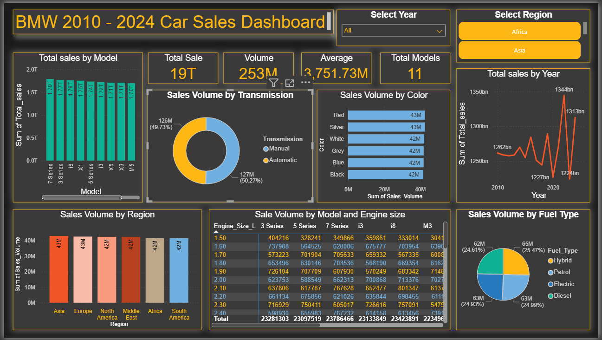

# BMW 2010–2024 Car Sales Analysis Dashboard

This repository contains an end-to-end data analysis and visualization project based on BMW car sales from 2010 to 2024.
Using Power BI, the dashboard highlights key insights related to sales performance across models, regions, engine sizes, fuel types, colors, and yearly trends.

The goal of this project is to help decision-makers understand BMW’s performance, identify market opportunities, and optimize strategy for production, sales, and marketing.

## Project Overview

This project focuses on analyzing BMW’s global car sales data from 2010 to 2024 and visualizing key performance metrics using Power BI. The goal is to provide business stakeholders with a clear understanding of sales trends, regional performance, model-wise demand, and engine/fuel preferences.
The dataset includes information such as model, year, region, fuel type, transmission, engine size, mileage, sales volume, and total sales. The dashboard consolidates this information into an easy-to-understand, interactive format that allows users to filter results and explore insights dynamically.

What This Project Delivers
A fully interactive Power BI dashboard
Insightful visualizations covering sales by:
Model
Year
Region
Transmission
Fuel Type
Color
Engine Size
A comprehensive breakdown of trends across 14 years
Business-driven analysis for data-based decision-making
Correlation between model performance and engine size
Regional demand comparison for strategic planning

Why This Project Is Valuable
This analysis helps answer important business questions like:
Which BMW models perform best in the market?
Which regions contribute the highest sales volume?
How have sales evolved over time?
What engine sizes and fuel types are most preferred by consumers?
How does color and transmission choice impact sales?

By centralizing all key performance indicators and trends in one dashboard, the project empowers BMW teams, analysts, and executives to make smarter, data-driven decisions regarding production strategy, marketing focus, pricing, and product planning.

## Key Dashboard Highlights

Total Sales, Total Volume, Average Sales, and Total Models
Sales by Model
Sales Volume by Transmission Type
Sales Volume by Color
Sales by Year (Trend Analysis)
Sales Volume by Region
Sales Volume by Fuel Type
Sales by Engine Size and Model (Matrix View)

## Interactive Filters

Year filter (2010–2024)
Region filter (Asia, Europe, North America, etc.)
Drill-down enabled for deeper insights
This dashboard allows BMW analysts, business teams, and management to understand key drivers behind sales performance.

## Dashboard Preview

## Business Questions Answered
This analysis focuses on the following 5 key business questions:

1️. Which BMW models have generated the highest total sales from 2010 to 2024?
Helps identify top-performing models and supports portfolio optimization.

2️. How have sales and volumes trended year-over-year?
Reveals growth patterns, market dips, and the impact of external events.

3️. Which regions contribute the most to BMW’s global sales volume?
Supports market expansion strategy and demand-driven production planning.

4️. What is the relationship between engine size and model sales performance?
Helps BMW understand whether certain engine configurations drive higher sales.

5️. Which fuel types and transmission preferences are most popular?
Useful for forecasting future demand, especially for hybrid and electric vehicles.

## Tools & Technologies Used
Technology	Purpose
Power BI Desktop	Dashboard creation and visual analysis
Python (Pandas)	Optional data cleaning and preprocessing
Jupyter Notebook	Exploratory data analysis
Excel/CSV	Raw data handling
DAX Formulas	Measures for Power BI visuals

## Key Insights Summary
Automatic transmission slightly leads sales over manual.
Asia shows the highest sales volume among all regions.
Petrol, Electric, and Diesel sales are almost evenly distributed.
Models like 3 Series, 5 Series, and X5 remain consistent top performers.
Engine sizes between 2.0L to 3.0L dominate the sales across the BMW lineup.

## How to Use This Dashboard
Download the .pbix file.
Open it with Power BI Desktop.
Use slicers to filter by Year or Region.

Hover over charts for detailed tooltips.

Explore model-wise, regional, and engine-size-based insights.
